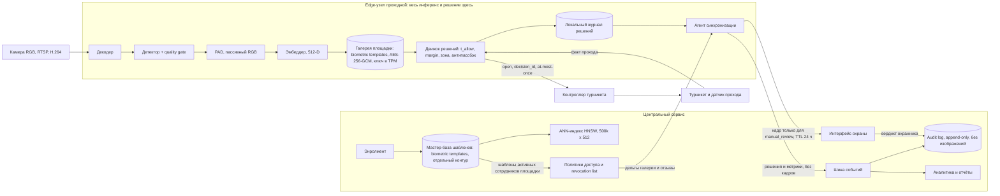
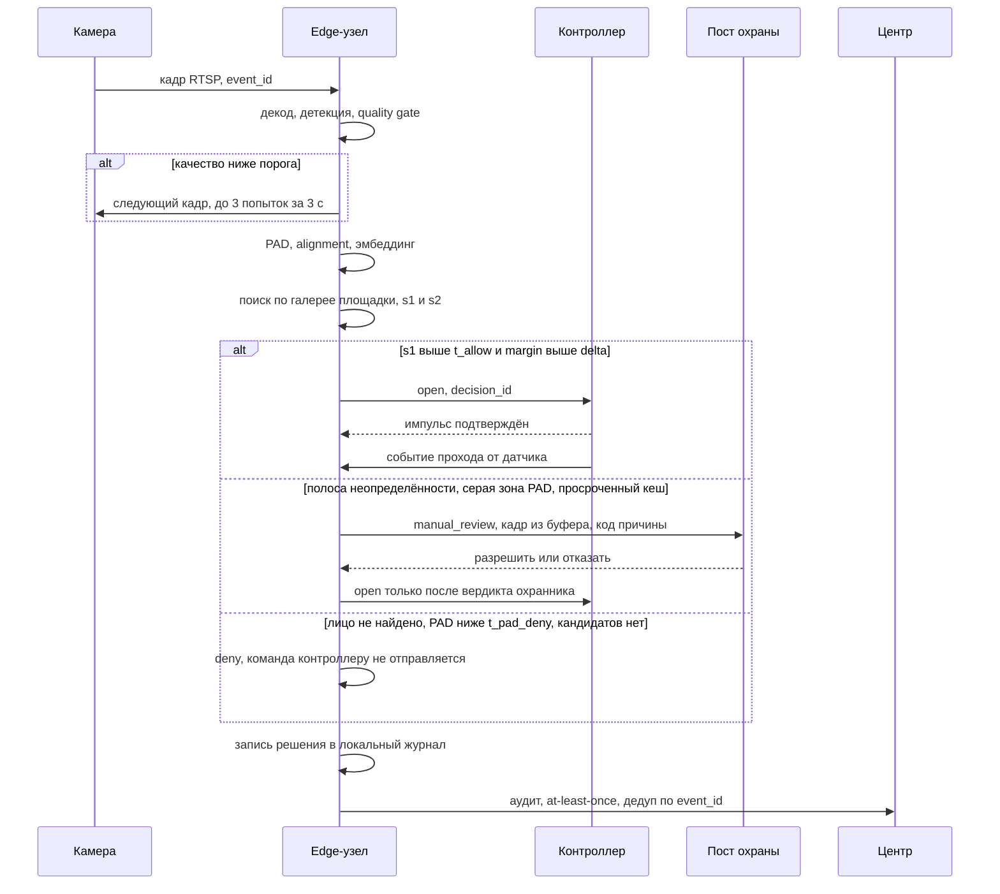

# Целевая архитектура

Проходная кампуса: 3 точки прохода, по 2 камеры на каждой, 12 000 сотрудников, около 19 000 проходов в сутки, ориентир 1 с от кадра до команды турникету на p95. Выбор моделей, порогов и метрик разобран в [ml.md](ml.md), эксплуатационные сигналы в [monitoring.md](monitoring.md), приватность и правовой контур в [risks-and-ops.md](risks-and-ops.md), деньги и раскатка в [product.md](product.md).

## Что где считается

| Функция | Где | Почему там |
|---|---|---|
| Декод, детекция, quality gate, alignment | edge-узел на проходной | round-trip до центра съедает секундный бюджет, а работа без сети требуется заданием |
| PAD, эмбеддинг, поиск по галерее площадки, решение, команда контроллеру | edge-узел | решение должно приниматься там, где стоит турникет, иначе обрыв канала блокирует проход |
| Галерея активных сотрудников площадки, локальный журнал решений | edge-узел | реплика вместо синхронного запроса: узел работает при недоступности центра |
| Энролмент, мастер-база шаблонов, ANN-индекс по всем площадкам | центральный сервис | единый источник истины, edge дописывать в мастер-базу права не имеет |
| Политики доступа, подписанный revocation list | центральный сервис | правила проверяет ИБ и меняет без релиза кода на узлах |
| Audit log, интерфейс охраны, аналитика, отчёты | центральный сервис | нужны сквозная картина по кампусу и хранение дольше жизни узла |

От схемы «кадр уходит в центр, инференс в центре» отказались по двум причинам: секундный бюджет не переживает деградацию канала, и по сети начинают ездить кадры лиц, из-за чего зона возможной утечки биометрии расширяется с трёх узлов до всего периметра. Обратный поток от edge ограничен решениями и метриками, шаблон с узла наружу не выгружается никогда.

Камеры RGB, RTSP, H.264, по две на проходную (вход и выход). NIR-канал заложен интерфейсом, но в MVP не ставится: разбор в разделе 9 [ml.md](ml.md). Ограничение развёртывания: не больше 4 потоков на узел. В прототипе собраны детекция, качество и PAD ([../poc/facegate/vision.py](../poc/facegate/vision.py)), галерея и поиск ([../poc/facegate/gallery.py](../poc/facegate/gallery.py)), движок решений ([../poc/facegate/policy.py](../poc/facegate/policy.py)), журнал ([../poc/facegate/audit.py](../poc/facegate/audit.py)) и сборка пути ([../poc/facegate/pipeline.py](../poc/facegate/pipeline.py)).

## Схема компонентов

Кадры обычных проходов не покидают узел и не сохраняются. В центр уходят решения, причины, скоры и метрики; кадр отправляется единственным маршрутом, на пост охраны при `manual_review`.

## Путь кадра до команды турникету

Бюджет времени по стадиям, p95 в миллисекундах:

| Стадия | p95, мс | Стадия | p95, мс |
|---|---|---|---|
| Захват и RTSP | 60–120 | Эмбеддинг | 5–15 |
| Декод | 5–15 | Поиск по галерее | не более 1 |
| Детекция | 8–20 | Политика | 3–10 |
| Quality gate | 2–5 | Команда по REST | 5–20 |
| Alignment | 1–3 | Команда по OSDP | 20–60 |
| PAD | 15–60 | | |

Сумма верхних границ 309 мс, целимся в 500 мс p95, вторые 500 мс держим запасом на повтор кадра. Складывать эти строки нельзя: p95 суммы не равен сумме p95 стадий, потому что стадии коррелируют через общую очередь на GPU и через качество кадра. Приёмка идёт сквозным замером от `captured_at` до отправки команды, а таблица нужна для планирования и для локализации просадки. Механика самого турникета в SLA не входит (задание меряет до команды), но её порядок называем: штанга 100–300 мс, створки 400–800 мс.

## Асинхронные части

1. Репликация галереи: pull дельт каждые 30–60 с, полный снапшот раз в сутки.
2. Revocation list: подписанный, с монотонным epoch, push через MQTT QoS1 retained или WSS, p95 доставки 1–5 с; при возрасте epoch свыше 15 минут узел уходит в ограниченный режим.
3. Досылка offline-журнала после восстановления связи, at-least-once с дедупом по `event_id`.
4. Отправка кадра на ручную проверку и приём вердикта охранника.
5. Аналитика, отчёты, сверка «решение против события прохода».
6. Перекалибровка порогов по отложенным меткам раз в неделю.
7. Энролмент и перевыпуск шаблонов.

Ни один из этих путей не блокирует открытие турникета, и обратное тоже верно: сбой шины событий останавливает аналитику, но не проход, потому что локальный журнал переживает разрыв и досылается позже.

## Хранилища

| Данные | Где | Срок | Защита |
|---|---|---|---|
| Шаблоны активных сотрудников площадки | edge-узел, 4 000 человек по 3 шаблона = 12 000 × 512 float32, около 24 МБ | пока сотрудник активен на площадке | AES-256-GCM, ключ в TPM, экспорт закрыт |
| Мастер-база шаблонов | центр, отдельный контур | пока сотрудник активен | раздельный доступ HR, ИБ, администратора СКУД |
| ANN-индекс | центр, 500 000 × 512 | живой | HNSW, tombstones, blue-green swap |
| База сотрудников без биометрии | центр, PostgreSQL | по правилам HR | связь с шаблоном только по идентификатору |
| Фото энролмента | нигде | удаляется сразу после построения шаблона | |
| Кадры обычных проходов | не сохраняются никогда | | |
| Кадр события `manual_review` | кольцевой буфер на edge, затем центр | 24 часа на узле, 30 суток в центре | только для ручной проверки и инцидентов |
| Audit log | центр | не меньше 1 года | append-only, без изображений и векторов |

Про индекс: 500 000 векторов по 512 float32 дают 977 МиБ flat, HNSW (M=32, ef_construction=200, ef_search=128) добавляет 145–150 МБ на граф. Выбрали HNSW ради RPS, роста базы и стоимости CPU на проход, а не ради p95 одного запроса: полный перебор на 500k даёт recall 1.0 за десятки миллисекунд и остаётся честным baseline. От IVF-PQ отказались, потому что экономия памяти здесь не нужна, а recall падает. На edge ANN вреден: он добавляет промахи recall без выигрыша по времени, поэтому там полный перебор, реализованный в [../poc/facegate/gallery.py](../poc/facegate/gallery.py). Интерфейс `search(vector, k)` одинаков для узла и центра, поэтому переезд с перебора на HNSW не трогает движок решений.

Экспорт галереи закрыт технически и логируется, сравнение доступно только через сервис, вектор наружу не отдаётся. Это дизайн-ответ на риск model inversion, а не доказательство необратимости шаблона.

## Интеграция с турникетом и идемпотентность

Основной путь к контроллеру: REST поверх mTLS (Sigur, PERCo, RusGuard, HID Aero). Выбрали REST, потому что на прикладном уровне есть куда положить ключ идемпотентности и откуда получить подтверждение. Для legacy-панелей edge эмулирует считыватель и отдаёт идентификатор по OSDP v2.2 Secure Channel (IEC 60839-11-5); тогда финальную политику применяет панель, и это надо учитывать при разборе аудита. От Wiegand как рабочего протокола отказались: открытый обмен и тривиальный replay, годится только временным мостом на период миграции. Требование к развёртыванию: сменить дефолтный SCBK и закрыть install mode, иначе Secure Channel не защищает ничего.

- `event_id` рождается вместе с попыткой прохода: повтор запроса с тем же значением возвращает сохранённое решение и не пересчитывает его, а сам повтор пишется в журнал отдельной записью (тест в [../poc/tests/test_poc.py](../poc/tests/test_poc.py));
- `decision_id` идентифицирует принятое решение и служит ключом дедупликации импульса на контроллере, окно 5–10 с;
- импульс at-most-once: лишнее открытие пропускает постороннего, потерянное стоит сотруднику повторного подхода, и цена этих ошибок несимметрична;
- аудит и досылка offline-журнала at-least-once с дедупом по ключу: потерянная запись хуже дубликата;
- каждое решение обязано сойтись с событием прохода от датчика, несошедшиеся пары уходят в алерт ([monitoring.md](monitoring.md)). Антипассбэк и датчики прохода обязательны, без них счёт «одно решение равно одному проходу» не сходится.

## Интерфейс ручной проверки

Пост охраны получает очередь событий со статусом `manual_review`. В карточке: кадр из кольцевого буфера, код причины (низкое качество, серая зона PAD, малый margin, просроченный кеш, отзыв доступа), время, проходная, камера, предполагаемый сотрудник со скором. Две кнопки: разрешить проход и отказать. Вердикт пишется в audit log вместе с идентификатором охранника и уходит в набор отложенных меток для еженедельной перекалибровки порогов.

Подробный UI не проектируем, задание это прямо запрещает. Верхнюю границу нагрузки задаёт охрана, а не модель: 0.2–0.5 % потока это 38–95 событий в день, в пике одно событие в 8 минут на пост. Пороги подбираются под этот бюджет, а не наоборот. Режим с участием охранника нужен ещё по одной причине: сверка с участием уполномоченного должностного лица выведена из-под 572-ФЗ (ст. 1 ч. 2), а насколько корпоративный СКУД по лицам вообще подпадает под этот закон, юридически не выяснено ([risks-and-ops.md](risks-and-ops.md)).

## Запасные пути при сбоях

| Отказ | Что делает узел | Как проходит сотрудник |
|---|---|---|
| Потеря сети, кеш до 1 часа | штатный режим | лицо |
| Кеш 1–24 часа | пороги подняты, всё сомнительное к охране | лицо, иначе охрана |
| Кеш 24–72 часа | лицо не принимается | карта с визуальной сверкой |
| Кеш старше 72 часов | кеш недействителен | только карта |
| Падение инференс-процесса | watchdog перезапускает, флаг degraded в ответе; 3 рестарта за 10 минут переводят узел в режим «только карта» до вмешательства эксплуатации | карта |
| Недоступна база сотрудников в центре | путь до команды не затронут, страдают энролмент и обновления | лицо |
| Пожарная сигнализация | размыкание питания аппаратно, софтовый контур не участвует | свободный проход |

Ни один сценарий не открывает турникет автоматически. Fallback идёт на карту и охрану, потому что карта юридически обязательна как небиометрическая альтернатива (152-ФЗ ст. 11, ТК РФ гл. 14) и одновременно дешевле разбора: 4 секунды на прикладывание против 4 минут и 120 ₽ у охраны. Деградация по возрасту кеша отработана в demo-событии `e-1005` (кеш 240 минут, исход `manual_review`, турникет закрыт).

## Отличия от референсного контракта

Поля запроса `POST /v1/access/verify` взяли из задания без изменений: `event_id`, `gate_id`, `camera_id`, `captured_at`, `frame_uri`, `metadata`. В demo-событиях ([../poc/demo/events.jsonl](../poc/demo/events.jsonl)) на месте `frame_uri` стоит блок `scene` с параметрами съёмки: кадр рисуется процедурно и на диск не пишется, поэтому ссылаться на файл там не на что. Из ответа сохранили все поля примера, потому что совместимость дороже красоты схемы.

Добавили два поля, оба лежат в каждой записи журнала (`poc/out/access_log.jsonl`):

- `next_action` со значениями `open`, `use_card`, `go_to_guard`: сотруднику на табло нужна инструкция, а не код причины, и вычислять её на стороне табло по семи полям ответа означает продублировать политику в клиенте;
- `cache_age_minutes` рядом с `degraded_mode`: булев флаг не отвечает на вопрос «насколько устарел кеш», а от возраста зависит и режим узла, и разбор события охраной.

Идентификатор шаблона и сам вектор в ответ не добавляли, хотя это упростило бы отладку: любой вынос вектора за границу сервиса сравнения ломает защиту от восстановления лица по шаблону, поэтому отладка идёт по скорам и кодам причин.
