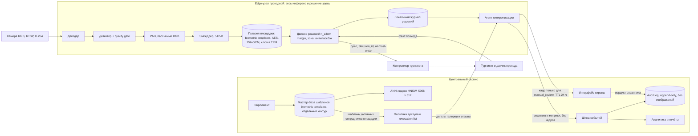
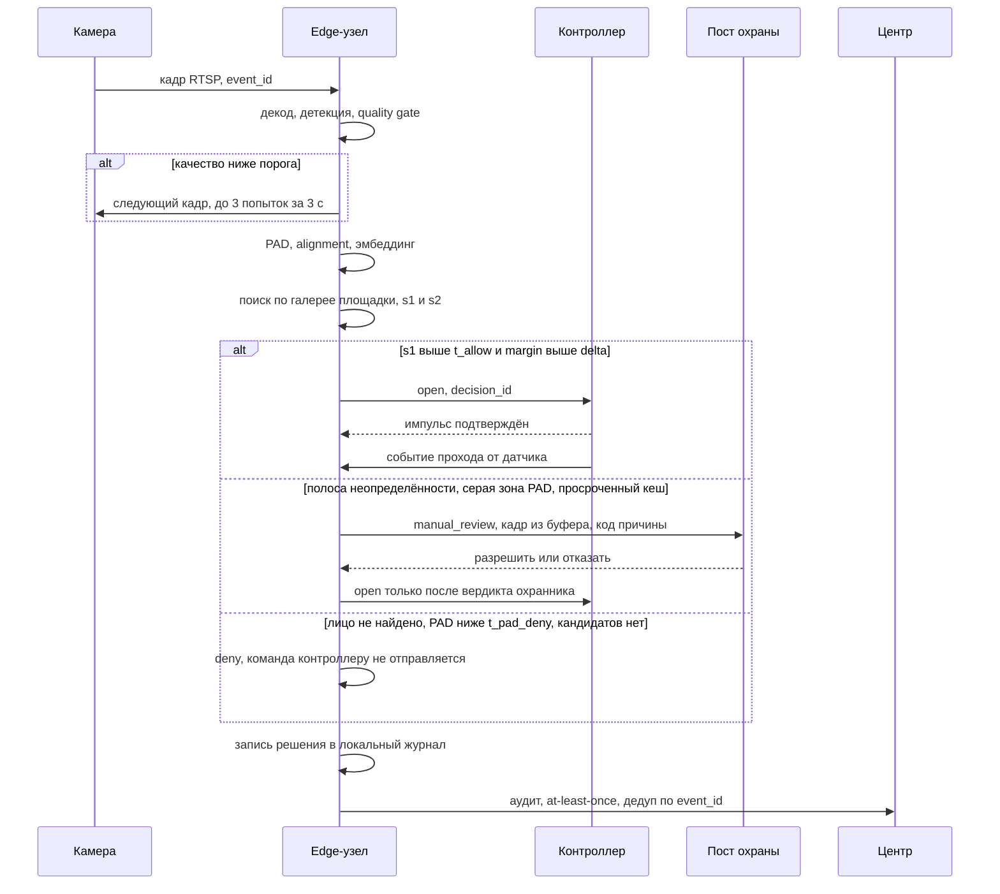

# Целевая архитектура

Проходная кампуса: 3 точки прохода, по 2 камеры на каждой, 12 000 сотрудников, около 19 000 проходов в сутки. Ориентир по времени: 1 с от кадра до команды турникету на p95. Выбор моделей, порогов и метрик разобран в [ml.md](ml.md), эксплуатационные сигналы в [monitoring.md](monitoring.md), приватность и правовой контур в [risks-and-ops.md](risks-and-ops.md), деньги и раскатка в [product.md](product.md).

## Граница edge и центра

Горячий путь целиком считается на проходной: декод, детекция, quality gate, alignment, PAD, эмбеддинг, поиск по локальной галерее, применение политики, команда контроллеру. Выбрали edge, потому что round-trip до центра при деградации канала съедает секундный бюджет целиком, а работа без сети записана в требованиях отдельной строкой. Отказались от схемы «кадр уходит в центр, инференс в центре» из-за второго следствия: по сети начинают ездить кадры лиц, и зона возможной утечки биометрии расширяется с трёх узлов до всего периметра.

Центр держит то, чего на горячем пути нет: энролмент, мастер-базу шаблонов, ANN-индекс по всем площадкам, политики доступа, аудит, интерфейс охраны, аналитику. Центр остаётся источником истины, edge живёт репликой и не имеет права дописывать в мастер-базу. Обратный поток от edge ограничен решениями и метриками; шаблон наружу с узла не выгружается никогда.

## Компоненты

Камера: RGB, RTSP, H.264, две на проходную (вход и выход). NIR-канал заложен интерфейсом, но в MVP не ставится, см. Р17 в [ml.md](ml.md).

Edge-узел на проходной, x86 с GPU или Jetson-класс, не более 4 потоков на узел:

- декодер H.264, NVDEC;
- детектор лица и 5 опорных точек;
- quality gate: резкость, экспозиция, размер лица, поза; низкое качество даёт retry, а не отказ;
- PAD (liveness), пассивный по RGB, двухпороговый;
- эмбеддер: alignment на 112x112 и вектор 512-D;
- локальная галерея активных сотрудников площадки, зашифрована AES-256-GCM;
- движок решений: пороги, margin до второго кандидата, расписание, зона, антипассбэк, TTL кеша, revocation list;
- локальный журнал решений, append-only, переживает потерю сети;
- агент синхронизации: pull дельт, приём push-отзывов, досылка журнала.

Контроллер турникета: применяет импульс, держит окно дедупликации, отдаёт назад состояние двери и событие прохода от датчика.

Центральный сервис:

- энролмент (регистрация сотрудника, построение шаблонов, проверка согласия);
- мастер-база шаблонов в отдельном контуре с раздельным доступом;
- ANN-индекс по всем площадкам;
- сервис политик доступа и подписанный revocation list;
- шина событий;
- audit log, append-only;
- интерфейс охраны для ручной проверки;
- аналитика и отчёты.

В прототипе собраны детекция, качество и PAD ([../poc/facegate/vision.py](../poc/facegate/vision.py)), галерея и поиск с margin ([../poc/facegate/gallery.py](../poc/facegate/gallery.py)), движок решений ([../poc/facegate/policy.py](../poc/facegate/policy.py)), журнал ([../poc/facegate/audit.py](../poc/facegate/audit.py)) и сборка горячего пути ([../poc/facegate/pipeline.py](../poc/facegate/pipeline.py)). Эмбеддер ([../poc/facegate/embed.py](../poc/facegate/embed.py)) и контроллер турникета мокнуты осознанно: реальные веса ArcFace research-only, а биометрию сотрудников собирать запрещено заданием.

## Схема компонентов

Кадры обычных проходов не покидают узел и не сохраняются. В центр уходят решения, причины, скоры и метрики; кадр отправляется единственным маршрутом, на пост охраны при `manual_review`.

## Горячий путь

Бюджет времени по стадиям, p95 в миллисекундах: захват и RTSP 60–120, декод 5–15, детекция 8–20, quality gate 2–5, alignment 1–3, PAD 15–60, эмбеддинг 5–15, поиск по галерее не более 1, политика 3–10, команда контроллеру 5–20 по REST или 20–60 по OSDP. Сумма верхних границ 309 мс. Целимся в 500 мс p95, вторые 500 мс держим запасом на повтор кадра при плохом качестве.

Сумма p95 стадий не равна p95 суммы: стадии коррелируют через общую очередь на GPU и через качество кадра, поэтому 309 мс годятся только как ориентир при планировании, а приёмка идёт по сквозному замеру от `captured_at` до отправки команды. Отсюда жёсткое ограничение: не более 4 потоков на edge-узел, иначе p99 разносит очередь на GPU, а не модель. Механика турникета в SLA не входит (задание меряет до команды), но её порядок называем: штанга 100–300 мс, створки 400–800 мс.

## Асинхронные части

1. Репликация галереи: pull дельт каждые 30–60 с, полный снапшот раз в сутки.
2. Revocation list: подписанный, с монотонным epoch, push через MQTT QoS1 retained или WSS, p95 доставки 1–5 с; при возрасте epoch свыше 15 минут узел уходит в ограниченный режим.
3. Досылка offline-журнала после восстановления связи, at-least-once с дедупом по `event_id`.
4. Отправка кадра на ручную проверку и приём вердикта охранника.
5. Аналитика, отчёты, сверка «решение против события прохода».
6. Перекалибровка порогов по отложенным меткам раз в неделю.
7. Энролмент и перевыпуск шаблонов.

Ни один из этих путей не блокирует открытие турникета. Обратное тоже верно: сбой шины событий останавливает аналитику, но не проход, потому что локальный журнал на edge переживает разрыв и досылается позже.

## Хранилища

База сотрудников живёт в центре (PostgreSQL): идентификаторы, расписания, зоны, статус согласия на биометрию, признак увольнения. Биометрии в ней нет, связь с шаблоном по идентификатору.

Хранилище шаблонов вынесено в отдельный контур с раздельным доступом трёх ролей (HR, ИБ, администратор СКУД). Фото энролмента удаляется сразу после построения шаблона. Экспорт галереи закрыт технически и логируется; сравнение доступно только через сервис, вектор наружу не отдаётся. Это дизайн-ответ на риск model inversion, а не доказательство необратимости шаблона.

ANN-индекс в центре: 500 000 векторов по 512 float32 дают 977 МиБ flat, HNSW (M=32, ef_construction=200, ef_search=128) добавляет 145–150 МБ. Выбрали HNSW ради RPS, роста базы и стоимости CPU на проход; отказались от IVF-PQ, потому что экономия памяти здесь не нужна, а recall падает. Полный перебор на 500k даёт recall 1.0 за десятки миллисекунд и остаётся честным baseline. Удаления через tombstones, перестройка при доле удалённых выше 15 %, подмена индекса blue-green.

На edge лежит только галерея активных сотрудников площадки: 4 000 векторов по 512 float32 = 8 МБ, полный перебор за доли миллисекунды. ANN на узле вреден, он добавляет промахи recall без выигрыша по времени. Шифрование AES-256-GCM, ключ в TPM. Кадры на узле не хранятся, кроме кольцевого буфера для `manual_review` с TTL 24 ч.

Audit log в центре: append-only, без изображений, срок хранения не менее 1 года. Кадры событий, ушедших на ручную проверку, и кадры инцидентов хранятся отдельно с TTL 30 суток. Единый интерфейс поиска `search(vector, k)` одинаков для edge и центра, поэтому переезд с полного перебора на HNSW не трогает движок решений; в PoC он реализован полным перебором в [../poc/facegate/gallery.py](../poc/facegate/gallery.py).

## Интеграция с турникетом

Решение принимает edge, поэтому основной путь к контроллеру: REST поверх mTLS (Sigur, PERCo, RusGuard, HID Aero). Выбрали REST, потому что на прикладном уровне есть куда положить ключ идемпотентности и откуда получить подтверждение. Для legacy-панелей edge эмулирует считыватель и отдаёт идентификатор по OSDP v2.2 Secure Channel (IEC 60839-11-5); в этой конфигурации финальную политику применяет панель, что надо учитывать при разборе аудита. Отказались от Wiegand как от рабочего протокола: открытый обмен, тривиальный replay с BLEKey-класса устройств, годится только временным мостом на период миграции. Требование к развёртыванию: сменить дефолтный SCBK и закрыть install mode, иначе Secure Channel не защищает ничего.

Идемпотентность построена на двух ключах. `event_id` рождается вместе с попыткой прохода: повтор запроса с тем же `event_id` возвращает сохранённое решение и не пересчитывает его (проверено тестом идемпотентности в [../poc/tests/test_poc.py](../poc/tests/test_poc.py)). `decision_id` идентифицирует принятое решение и служит ключом дедупликации импульса на контроллере, окно 5–10 с. Семантика импульса at-most-once: лишнее открытие пропускает постороннего, потерянное стоит сотруднику повторного подхода, и цена этих ошибок несимметрична. Аудит и досылка offline-журнала, наоборот, at-least-once с дедупом по ключу. Каждое решение обязано схлопнуться с событием прохода от датчика; несхлопнутые пары уходят в алерт, см. [monitoring.md](monitoring.md). Антипассбэк и датчики прохода обязательны, без них счёт «одно решение = один проход» не сходится.

## Интерфейс ручной проверки

Пост охраны получает очередь событий со статусом `manual_review`. В карточке события: кадр из кольцевого буфера, код причины (низкое качество, серая зона PAD, малый margin, просроченный кеш, отзыв доступа), время, проходная, камера, предполагаемый сотрудник со скором. Две кнопки: разрешить проход и отказать. Вердикт пишется в audit log вместе с идентификатором охранника и уходит в набор отложенных меток для еженедельной перекалибровки порогов.

Подробный UI не проектируем, задание это прямо запрещает. Верхнюю границу нагрузки задаёт охрана, а не модель: 0.2–0.5 % потока = 38–95 событий в день, в пике одно событие в 8 минут на пост. Пороги подбираются под этот бюджет, а не наоборот.

Режим с участием охранника нужен ещё по одной причине: сверка с участием уполномоченного должностного лица выведена из-под 572-ФЗ (ст. 1 ч. 2). Насколько корпоративный СКУД по лицам вообще подпадает под 572-ФЗ, юридически не выяснено, экспертизы у команды нет, вопрос вынесен в [risks-and-ops.md](risks-and-ops.md) как открытый.

## Запасные пути при сбоях

Потеря сети. Узел работает по локальной галерее и локальному журналу. Возраст кеша до 1 ч считается штатным. От 1 до 24 ч пороги повышаются, всё сомнительное уходит охране. От 24 до 72 ч работает только карта с визуальной сверкой. После 72 ч кеш недействителен, лицо не принимается вовсе. Сценарий отработан в demo-событии `e-1005` (кеш 240 минут, сотрудник в revocation list, исход `manual_review`, турникет закрыт).

Недоступность модели или падение инференс-процесса. Watchdog перезапускает процесс, узел помечает себя degraded и отдаёт это флагом в ответе, проход идёт по карте, событие уходит в мониторинг. Отдельно контролируем перезапуск по кругу: три рестарта за 10 минут переводят узел в режим «только карта» до вмешательства эксплуатации.

Недоступность базы сотрудников в центре. Горячий путь от неё не зависит по построению, страдают энролмент, изменения политик и доставка дельт. Узел продолжает работать на кеше по правилам первого сценария, и это главный аргумент за реплику вместо синхронного запроса.

Ни один из трёх сценариев не открывает турникет автоматически. Fallback идёт на карту и охрану, потому что карта юридически обязательна как небиометрическая альтернатива (152-ФЗ ст. 11, ТК РФ гл. 14) и одновременно дешевле разбора: 4 секунды на прикладывание против 4 минут и 120 ₽ у охраны. Пожарная сигнализация разблокирует проход аппаратно, снятием питания, и в софтовый контур не заводится.

## Отличия от референсного контракта

Поля запроса `POST /v1/access/verify` взяли из задания без изменений: `event_id`, `gate_id`, `camera_id`, `captured_at`, `frame_uri`, `metadata`. Из ответа сохранили `decision_id`, `decision`, `employee_id`, `match_score`, `margin_to_second_best`, блок `quality`, `reasons`, `turnstile_command`, `requires_human_review`, `degraded_mode`, `audit_id`, `latency_ms`. Совместимость дороже красоты схемы, а перечисленных полей хватает для трёх исходов.

Добавили два поля. `next_action` со значениями `open`, `use_card`, `go_to_guard`: сотруднику на табло нужна инструкция, а не код причины, и вычислять её на стороне табло по семи полям ответа означает продублировать политику в клиенте. `cache_age_minutes` рядом с `degraded_mode`: булев флаг не отвечает на вопрос «насколько устарел кеш», а от возраста зависит и режим узла, и разбор события охраной. Оба поля видны в выводе демонстрации ([../poc/run_demo.py](../poc/run_demo.py)) и в записях [../poc/demo/events.jsonl](../poc/demo/events.jsonl).

Не добавляли идентификатор шаблона и вектор в ответ, хотя это упростило бы отладку: любой вынос вектора за границу сервиса сравнения ломает защиту от восстановления лица по шаблону, и отладку придётся вести по скорам и кодам причин.
